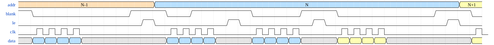

HUB75 driver overview
=====================

Principle of operation
----------------------

An example wave form is show below :

Note this is just an illustration of BCM modulation and control for these
panels and is not a cycle accurate representation of the signals generated
by this driver.

General principle is :

* Shift in the data for the new row/plane to be displayed
* When the current row/plane display is done (i.e. shown for the right
   amount of time):
     * Assert the blanking signal
     * Wait for the data shift to be done if required
     * Use the Latch signal to transfer data from the shift register to
       the output register.
* De-assert the blanking signal for the required amount of time for this
  BCM plane
* Go to the next plane and or next row

This driver supports to have a minimum bit length for the BCM to be shorter
than the time it takes to shift in the data and it will drive the blanking
signal accordingly. The compromise in this case is the light efficiency is
slightly reduced in favor of an increased refresh rate.

A tool to compute the timings you can achieve is provided in the `sw/`
subdirectory. And the length of the minimum BCM plane is controlled by
the `cfg_bcm_bit_len` signal of `hub75_top`.

Modules
-------

A quick list of the modules and what they do :

* Frame buffer logic : Described in more details [here](framebuffer.md)
    * `hub75_fb_readout`
    * `hub75_fb_writein`
    * `hub75_framebuffer`
    * `hub75_linebuffer`

* Color Mapping : Converts from `BITDEPTH` wide words to actual values used in BCM for each color
    * `hub75_colormap`
    * `hub75_gamma`

* Low-level BCM driver
    * `hub75_bcm`
    * `hub75_blanking`
    * `hub75_scan`
    * `hub75_shift`

* Top level from driver with frame buffer
    * `hub75_top`

Main high-level driver
----------------------

The module `hub75_top` provides an example on how to use the low level blocks
to make a full driver that uses a frame buffer and exposes a convenient
interface to write data and request frame swap.

It is fully configurable for various geometry of panels using the parameters :

* `N_BANKS`: How many rows are shifted/displayed in parallel
* `N_ROWS`: The number of rows in each bank (i.e. the number of multiplexed rows)
* `N_COLS`: The total number of columns in the chain of panels
* `N_CHANS`: How many channels, in general this is 3 for RGB panels
* `N_PLANES`: How many bitplanes are modulated using BCM
* `BITDEPTH`: The width of each pixel color when fed in and store in the frame buffer

Low-level BCM driver
--------------------

The low level modules can be used independently of the frame buffer if you
need to drive panels without a frame buffer. The way to use and connect them
is illustrated in the `hub75_top` module.

You will then need to be able to provide the pixel values on demand. You
can also just use a row buffer to make this easier (since the low level driver
needs random access in rows without delays, it's easier to at least have
a row buffer).

* `hub75_scan`: This is sort of the high level control and coordinates the
                scanning of all the rows in the panel.
* `hub75_bcm`: This controls the BCM modulation for each row following the
               commands from the `scan` module. It handles shifting the data,
	       controling the blanking and properly enabling the row driver.
* `hub75_blanking`: This is the submodule that specifically handled the blanking
                    signal control for each BCM plane.
* `hub75_shift`: This is the submodule that specifically handles the data
                 shifting.
