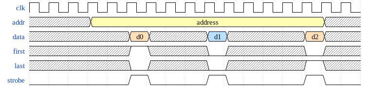

SPI Slave IP core
=================

Overview
--------

This contains a couple of core that help control logic on the FPGA
from a host connected through SPI (for instance using the same FTDI/other
chip that's used for the configuration of the FPGA itself).

Communication is highly optimized for the host -> fpga direction and
the backchannel is _very_ limited, only a single status byte.

Two version exist, a 'fast' version and a 'simple' version that are
described below. There is also an helper `spi_reg` core that 


"Simple" core: `spi_simple.v`
-----------------------------

This core is very simple and fully synchronous to the system clock.

This means that to detect rising/falling edge of the SPI clock signal, this
signal is sampled (through synchronizers) at the system clock frequency.
And in effect this means that the SPI clock itself must be roughly 4 times
slower than the system clock frequency for this detection to be reliable.


"Fast" core : `spi_fast.v`
--------------------------

In opposition to the 'simple' core, this one actually has two clock domains
and the serial to parallel conversion along with the sampling of the data line
is done using the actual SPI clock signal and thus allowing much higher
SPI clock rates than the system clock itself.

The downside is that to ensure proper IO timings, some of the logic elements
have to be manually instanciated and manually placed. This makes this core
harder to understand and also limits it to only work on the Ultra Plus 5k
device when using the exact pins used for the FPGA configuration.

```
set_io -nowarn slave_mosi 14
set_io -nowarn slave_miso 17
set_io -nowarn slave_cs_n 11
set_io -nowarn slave_clk 15
```


Bus interface
-------------

On the SPI side, the first expected byte is the target address. Then
each subsequent byte is considered to be a payload byte for that address,
the exact interpretation is left up to the user.

On the return channel direction, either the first or the second byte will
contain the status byte from the fpga to the host. All other bytes are
undefined. Wether it's the first or the second byte that's used depend on
which spi core (fast/simple) is in use. The other one is guaranteed to be
either 0 or the same, so the best option is to OR those two to get the real
status byte.

On the FPGA side, the SPI transaction is converted to a 8 bit parallel bus
with a validity strobe along with indicators wether this is the first/last
byte of a burst. Burts being defined as CS falling/rising.




License
-------

These cores are licensed under the BSD 3-clause licence (see LICENSE.bsd)
